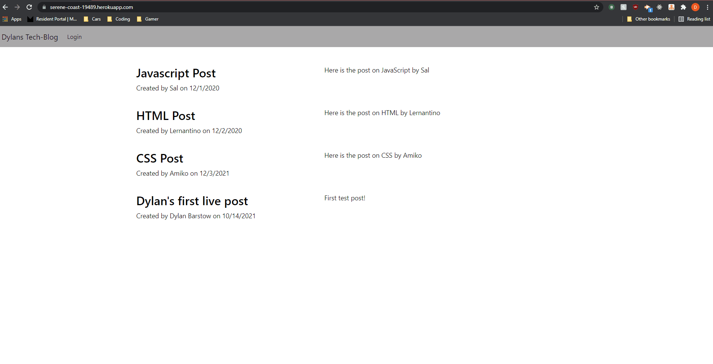

# A Tech Blog

## Table of Contents

- [Description](#Description)
- [Installation](#installation)
- [Usage](#usage)
- [Technologies Used](#tech)

## Description

This project was a CMS-style blog site similar to wordpress. Developers can publish their blog posts and comment on other developers’ posts as well. The app follows the MVC paradigm in its architectural structure, using Handlebars.js as the templating language, Sequelize as the ORM, and the express-session npm package for authentication.

## Installation

To run this app locally, clone the repo, navigate to the root folder, then use the following commands in your terminal.

Install needed packages with:
`npm i`

Install seed data with:
`npm run seed`

Start the Server with:
`npm start`

## Usage

*Instructions for use:*
Add a user by signing up with a new Username, email, and password. Once created you have the ability to create new post. The new post will show up in your dashboard where you can edit or delete as well as comment on the post. The home page will take you the overview of the page and show you all available posts. Logout and you will still see all posts but you can only view comments, you will not be able to edit, comment, or delete a post until you log back in.

## Tech

Bcrypt, Bulma, Dotenv, Express. Handlebars, mysql2, sequelize
